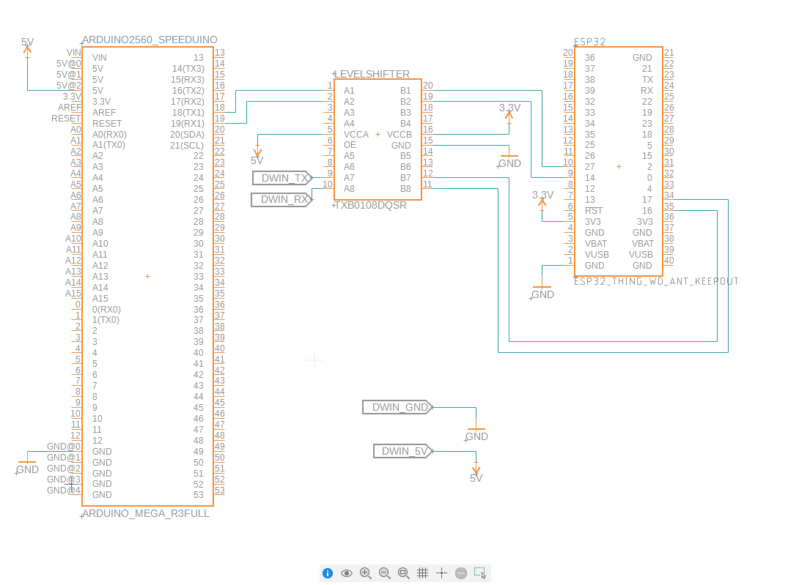
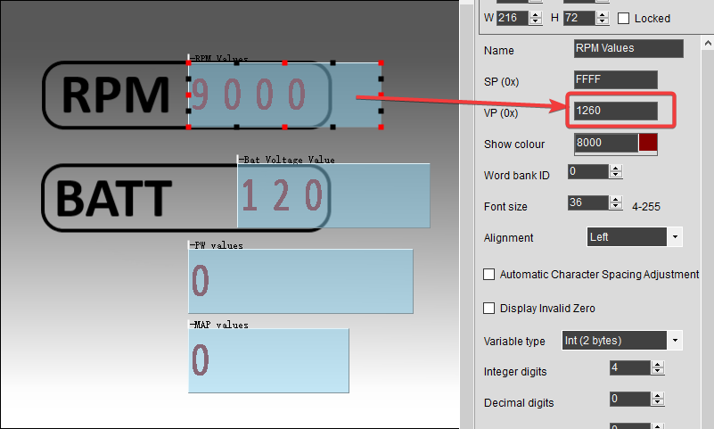
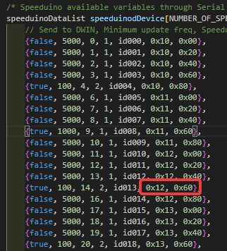

All connections between the Arduino Mega and the ESP32 should be made trough a Level Shifter (5V<->3.3V).

### Connections

Arduino Mega PIN RX3 <-- 5V -- level shifter -- 3.3V --> ESP32 PIN D14

Arduino Mega PIN TX3 <-- 5V -- level shifter -- 3.3V --> ESP32 PIN D27

ESP32 PIN TX2 <-- 3.3V -- level shifter -- 5V --> DWIN RX

ESP32 PIN RX2 <-- 3.3V -- level shifter -- 5V --> DWIN TX

### DWIN design

Each DWIN variable VP (0x) must be set according to the speedvars.h definitions

### DWIN UART mode

By default my DWIN display came in RS232 mode. It was needed to short a path in the back to enable the UART mode.
